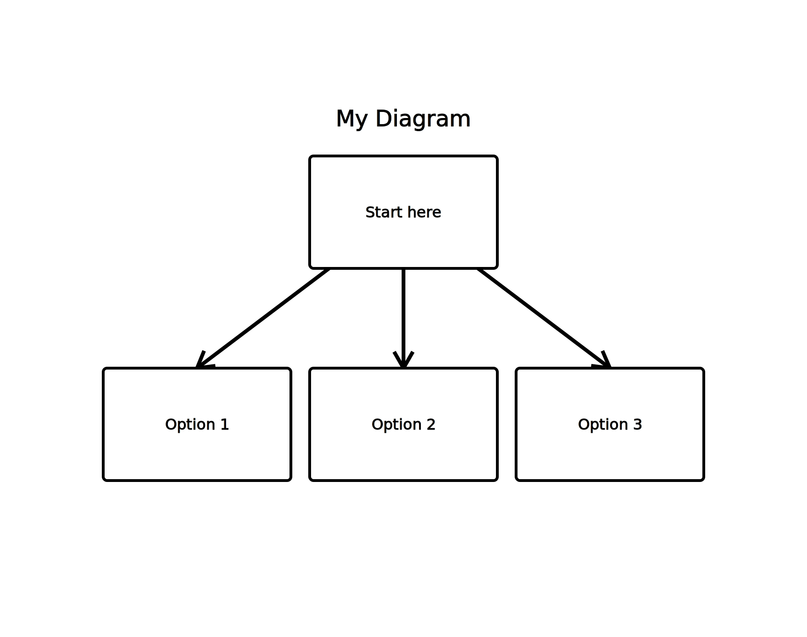

<h1 align="center">Logos</h1>

</img>

<h2>About</h2>  

Designed for programmers to outline their logic and thoughts visually, Logos is a powerful diagramming and graphing tool that uses its own language with easy to understand grammar and syntax, so you can generate diagrams and graphs that represent your ideas with ease.

Written entirely from scratch in C, Logos is fast and lightweight. It requires no external libraries or dependencies.

<h3>How it works</h3>

Logos scans and parses the supplied text file and constructs a graph of nodes and edges defined by the user. The graph is then "drawn" by a custom svg library and outputted as an svg file.
<h2>Features</h2>
<ul>
    <li><b>Graph Representation: </b>Automatically generate a visual representation of your logic in the form of graphs and diagrams.</li>
    <li><b>Custom Language: </b>A simple and easy to understand language for creating your graph/diagram with node representations and edges.</li>
    <li><b>Customizable Output: </b>Customize the appearance of your diagrams, including background color, node color, and font-size.</li>
</ul>
<h2>Getting Started</h2>
<h3>Prerequisites</h3>

To use Logos, you need the following:

<ul>
    <li>A C compiler (e.g. GCC)</li>
    <li>Basic knowledge of creating and editing text files</li>
</ul>
<h3>Installation</h3>

Clone the repository to your local machine:

<code>git clone git@github.com:yari-dewalt/logos.git
cd logos</code>

Compile the project:

<code>make</code>
<h3>Usage</h3>
<ol>
    <li>
        
<b>Create a Text File:</b>

        
Write your logic in a text file using the defined syntax and grammar. For example:

        <code>{"My Diagram"}
A = "Start here"
B = "Option 1"
C = "Option 2"
D = "Option 3"
A -> B
A -> C
A -> D</code>
    </li>
    <li>
    
<b>Run the Program:</b>

    
Provide the text file to Logos:

    <code>./logos input.txt [...options]</code>
    </li>
    <li>
    
<b>View the Output:</b>

    
Logos will generate an SVG file representing your logic as a graph. Open the SVG file in a web browser or any compatible viewer to see the visual representation.

    

        </img>
    

</ol>
<h3>Syntax and Grammar</h3>

The basic syntax for creating a graph/diagram in Logos includes defining nodes and their connections. Here's an outline for creating your own graph:

<code>{ "My Graph Title" }
Node1 = "First Node" // Node (variable) declaration.
Node2 = "Second Node"
Node1 -> Node2 // Edge creation (Node1 points towards Node2)
Node2 <-> Node3 = "Node 3"
/* ^^^
Double edge creation and inline declaration /*</code>
<h4>Title Definition</h4>
<ul>
<li>
Curly braces '{}' are used to define a title for the graph/diagram and expect a string. This is typically done at the beginning for clarity but can be defined anywhere in the text file or not at all.

<code>{ "My Graph Title" }</code>
</li>
</ul>
<h4>Node/Variable Declaration</h4>
<ul>
<li>
Nodes/variables are defined and later referenced by identifiers. They must be assigned to a string or a separate identifier. The first time a node receives an edge, it becomes a child of that node so order matters! <b>Note: </b> The node with the first edge created in the graph becomes the root node.

<code>Node1 = "First Node"
Node2 = "Second Node"
Node 3 = Node1</code>
</li>
<li>These values can be later changed/redeclared as well.
</ul>
<h4>Edge Creation</h4>
<ul>
<li>
`->` is used for creating a directional edge (connection) from one node to another.

<code>Node1 -> Node2</code>
</li>
<li>
`<->` is used for creating a bidirectional edge (connection) between two nodes.

<code>Node1 <-> Node3</code>
</li>
</ul>
<h4>Inline Declarations and Chaining</h4>
<ul>
<li>
Inline declarations allow you to define and connect nodes in a single line. (However, assigning to another identifier is <b>not</b> allowed to keep edge creation clear)

<code>Node2 <-> Node3 = "Node 3"</code>
<li>
Chaining assignments and connections is also possible:

<code>A = B = C = "Nodes"
A -> B <-> C
A -> B = "B Child" <-> C = "C Child"
</code>
</li>
<h4>Comments</h4>
<li>
`//` can be used to comment out an entire line.

<code>// TODO: Add more options</code>
</li>
<li>
`/*` ... `*/` can be used to comment out multiple lines (upto wherever the closing multi-line quote character is).

<code>/* This is an example
of
multi-line
comments!</code>
</li>
</ul>
<h3>Customization</h3>

You can customize the appearance of your graphs/diagrams by using optional flags:

<ul>
    <li><b>-bgc [color] (--background-color [color])</b> for background color.</li>
    <li><b>-nc [color] (--node-color [color])</b> for node color.</li>
    <li><b>-ts [color] (--text-size [size])</b> for text size.</li>
    <li><b>--help</b> for help information.</li>
    <li><b>--version</b> to check the program version.</li>
</ul>

<b>Note: </b>All option values that are valid svg values will work. This means that color names like "white" or hex or rgb values will work. If they aren't valid there will be unexpected results. It is recommended to surround option values with double quotes (examples: "orange", "rgb(30, 30, 30)", "#FFFFFFF", "24"). It should also work without but shells can behave differently (I know sometimes the parentheses without a double quote can cause problems).

<h2>Contribution</h2>

Contributions are welcome! Feel free to open an issue or submit a pull request.

<h2>License</h2>

This project is licensed under the MIT License - see the LICENSE file for details.

<h2>Acknowledgements</h2>

Thank you to <a href="https://github.com/mermaid-js/mermaid">Mermaid</a> for the inspiration for this project.

